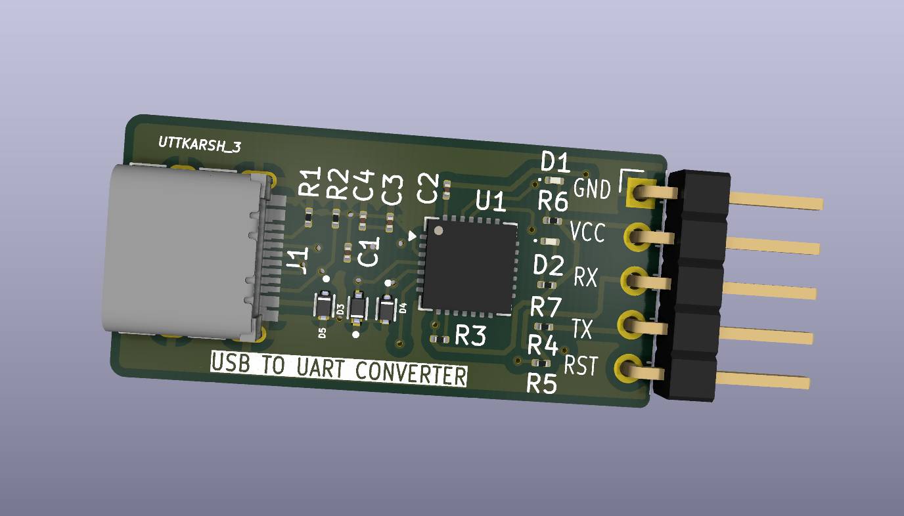
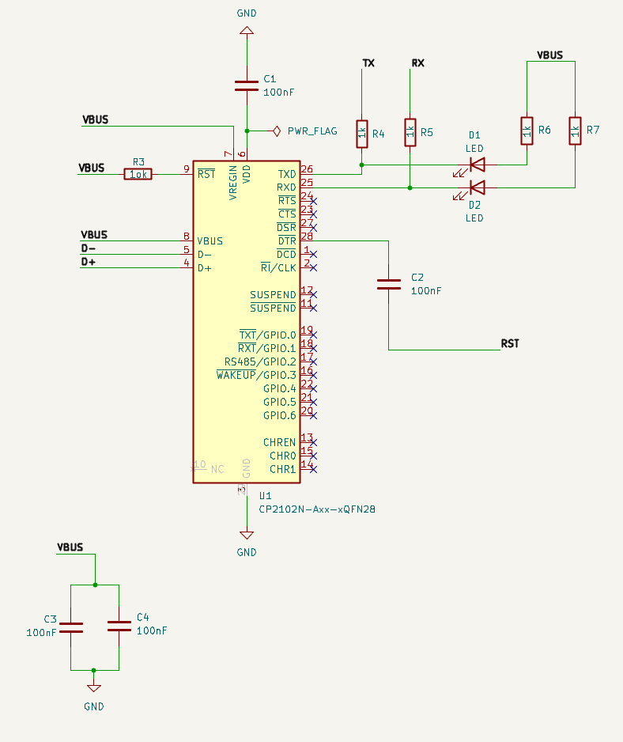
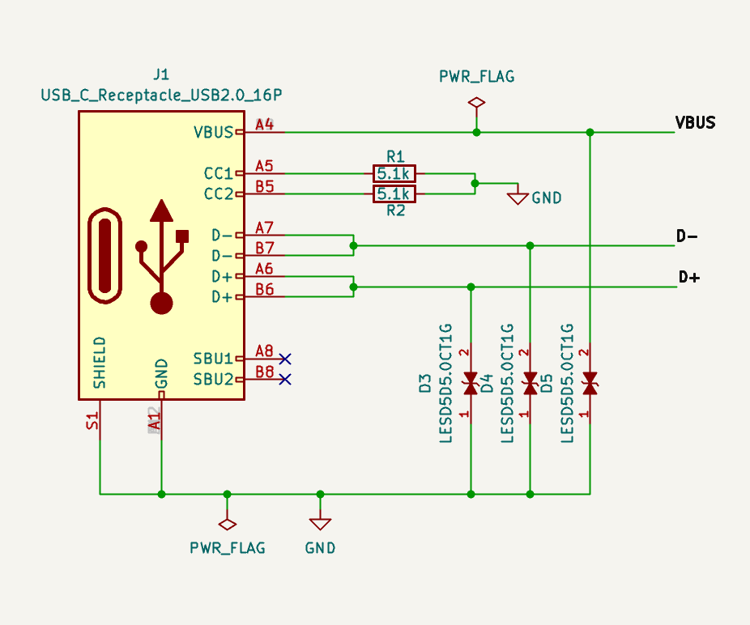
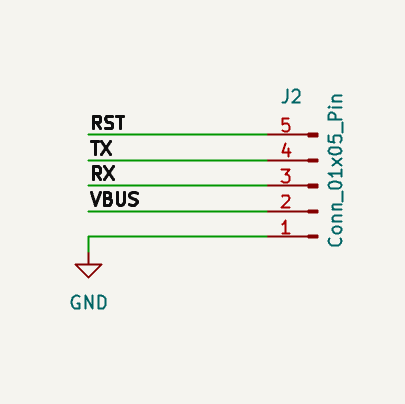

### 💡 USB Type-C to UART Converter

---

## ⚙️ What I Built

A compact, production-style USB-to-UART bridge designed in KiCad using the CP2102N USB-to-serial interface IC.

The board enables reliable serial communication between a host PC and embedded systems for debugging, firmware flashing, and data exchange. It is designed as a plug-and-play development tool that replaces generic USB-to-UART adapters with a cleaner, integrated hardware solution.

--- 

## 🚀 Overview

This project implements a robust USB-to-UART hardware interface using a USB Type-C connector and the CP2102N USB bridge IC.

---

## 📷 Project Gallery

🧩 **3D PCB Render**

Final assembled board visualization from KiCad 3D viewer.

🟠 **PCB Layout – Top Copper**

Top layer routing showing USB interface, CP2102N placement, and signal routing.

.png)

🔵 **PCB Layout – Bottom Copper**

Bottom layer used for ground plane and signal return integrity.

.png)

⚙️ **Schematic – Power Section**

Power input stage including USB VBUS handling, decoupling, and regulation strategy.

🔌 **Schematic – USB Interface Section**

USB Type-C interface with CC resistors, ESD protection, and data routing.

📡 **Schematic – UART Interface Section**

CP2102N UART communication block with TX/RX routing and headers.

---

## ✨ Features

* USB Type-C interface (USB 2.0)
* CP2102N USB-to-UART bridge IC
* TX/RX UART communication support
* RX/TX status indicator LEDs
* USB data line ESD protection
* Compact 2-layer PCB design
* Dedicated UART breakout header
* USB-powered operation (5V VBUS input)

---

## ⚒️ Hardware Architecture

USB Type-C
     │
     ▼
ESD Protection
     │
     ▼
CP2102N USB-to-UART Bridge
     │
     ▼
UART Header (TX, RX, GND, VBUS, RST)

---

## 🧠 Schematic Highlights

**USB Type-C Interface**

* USB 2.0 Type-C receptacle used
* CC1 and CC2 configured with 5.1kΩ pull-down resistors
* D+ and D− routed directly to CP2102N
* ESD protection added to improve robustness against hot-plug events and electrostatic discharge

**CP2102N Interface**

* Handles USB enumeration and serial conversion
* Powered directly from USB VBUS (5V)
* Decoupling capacitors placed close to power pins for stability
* Designed for stable and noise-resistant communication

**UART Header**

The board exposes a standard UART interface for external devices:

| Pin  | Function      |
| ---- | ------------- |
| GND  | Ground        |
| VBUS | 5V Supply     |
| RX   | UART Receive  |
| TX   | UART Transmit |
| RST  | Reset Line    |

---

## 🧩 PCB Design Insights

**Layout Strategy**

* Compact footprint optimized for embedded use
* USB connector placed at PCB edge for accessibility
* Solid ground plane for improved signal integrity
* Clear separation between power and signal routing

**Routing Strategy**

* USB D+ / D− routed as a differential pair
* Short and direct trace routing for signal integrity
* Decoupling capacitors placed close to IC power pins
* Continuous ground reference used to minimize noise

---

## 🧪 Applications

* MCU flashing (ESP32, STM32, AVR, etc.)
* Embedded system debugging
* Serial terminal communication
* IoT development workflows
* Firmware logging and monitoring

---

## ⚠️ Limitations

* No galvanic isolation (direct USB ground connection)
* Fixed logic levels (no onboard level shifting)
* USB-powered only (no external power input)
* No auto-reset circuitry for ESP-class boards

---

## 🚀 Future Improvements

* Auto-reset support for ESP-based boards
* Switchable 3.3V / 5V logic levels
* Onboard LDO regulator for cleaner power rail
* Polyfuse protection for overcurrent safety
* Test pads for signal debugging
* Enhanced EMI/ESD protection stage

---

## 🎓 Learning Outcomes

This project demonstrates practical experience in:

* KiCad schematic and PCB design workflow
* USB 2.0 hardware implementation
* CP2102N integration and configuration
* High-speed signal routing fundamentals
* Power integrity and decoupling design
* Ground plane design methodology

---

## 🛠️ Design Software

* KiCad 10 (Schematic + PCB Layout + 3D Render)
